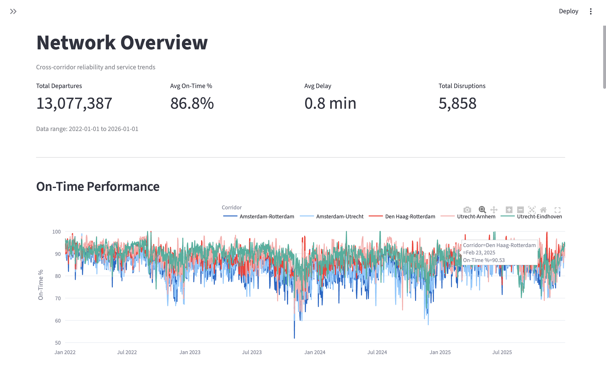
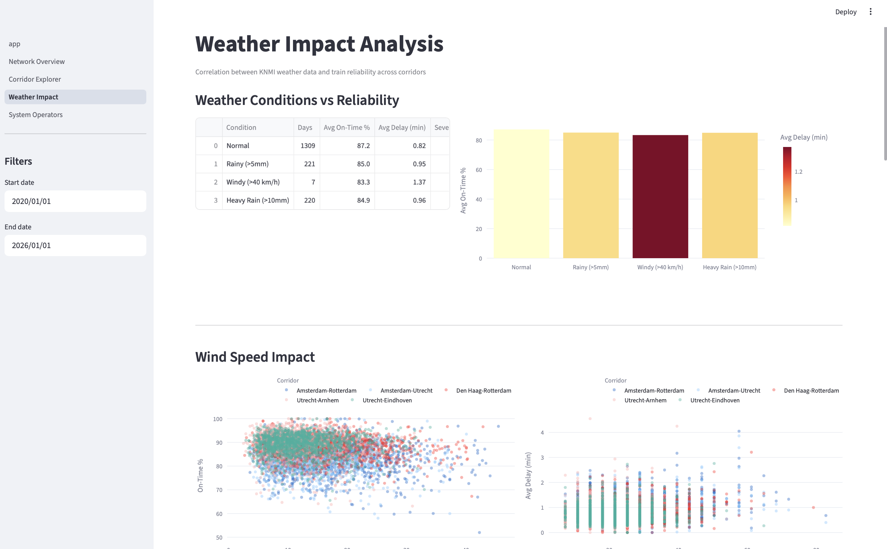
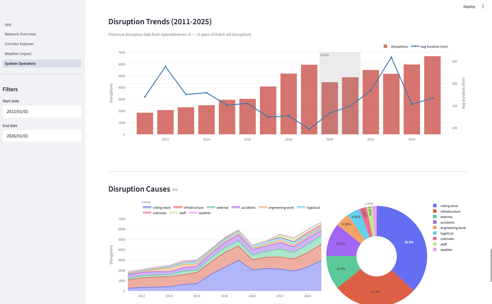

# NL Transport Pulse

End-to-end data engineering pipeline analyzing Dutch railway performance, weather impact, and disruption patterns. Built for the [DataTalksClub DE Zoomcamp 2026](https://github.com/DataTalksClub/data-engineering-zoomcamp).

## Problem Statement

The Netherlands has one of Europe's densest rail networks, operated by 20+ companies across national, regional, and international services. Passengers experience delays daily but lack data-driven insight into *why* — is it weather, a specific operator, a corridor bottleneck, or cascading disruptions?

This project builds a pipeline that ingests train performance data (70M+ departures from 2019–2026), weather observations, disruption records, and operator metadata, transforms it through a medallion architecture, and serves an interactive dashboard for corridor-level reliability analysis.

**Submission scope:** rail performance, weather impact, and disruption analytics. Road traffic / NDW files are present as a documented future extension, but the submitted end-to-end path is the verified rail + weather pipeline.

## Architecture

```
┌─────────────────────────────────────────────────────────────────┐
│  DATA SOURCES                                                    │
│  NS API (live departures + disruptions, 4x daily)               │
│  RDT open data (historical services 2019–2026 + disruptions     │
│                  2011–2025, monthly batch)                       │
│  KNMI (Dutch weather observations, daily)                       │
├─────────────────────────────────────────────────────────────────┤
│  ORCHESTRATION — Apache Airflow                                  │
│  ┌──────────┐  ┌──────────┐  ┌──────────┐  ┌──────────────┐    │
│  │NS ingest │  │KNMI      │  │RDT       │  │RDT backfill  │    │
│  │4x daily  │  │daily     │  │monthly   │  │(manual,      │    │
│  │          │  │          │  │auto      │  │ one-time)    │    │
│  └────┬─────┘  └────┬─────┘  └────┬─────┘  └──────┬───────┘    │
│       └──────────────┴─────────────┴───────────────┘            │
│                              │                                   │
│                         GCS (raw JSON/CSV archive)              │
│                              │                                   │
│                         BigQuery (raw)                           │
│                              │                                   │
│  TRANSFORMATION — dbt Core                                       │
│  ┌──────────────────────────────────────────────────┐           │
│  │  raw → staging (clean, type, dedup)              │           │
│  │  staging → intermediate (combine, enrich)        │           │
│  │  intermediate → core (star schema, aggregates)   │           │
│  └──────────────────────────────────────────────────┘           │
│                              │                                   │
│  SERVING — Streamlit + Plotly                                    │
│  ┌──────────────────────────────────────────────────┐           │
│  │  Network Overview │ Corridor Explorer            │           │
│  │  Weather Impact   │ System & Operators           │           │
│  └──────────────────────────────────────────────────┘           │
└─────────────────────────────────────────────────────────────────┘
```

## Data Pipeline

### Sources

| Source | What | Volume | Frequency |
|--------|------|--------|-----------|
| [rijdendetreinen.nl](https://www.rijdendetreinen.nl/en/open-data) | Historical train departures (every stop of every train) | ~1.7M rows/month | Monthly archive |
| [rijdendetreinen.nl](https://www.rijdendetreinen.nl/en/open-data) | Disruption records (cause, duration, affected stations) | 62K records (2011–2025) | Yearly archive |
| [NS API](https://apiportal.ns.nl/) | Live departure boards + active disruptions | ~2K rows/day | 4x daily |
| [KNMI](https://www.knmi.nl/) | Weather observations (temp, wind, rain) per station | ~100 rows/day | Daily |

### Medallion Architecture (dbt)

```
Bronze (raw)                Silver (staging + intermediate)         Gold (core)
─────────────              ───────────────────────────────         ──────────────
rdt_services          →    stg_rdt_services                   →   fct_train_performance
rdt_disruptions       →    stg_rdt_disruptions                →   dm_multimodal_daily
ns_departures         →    stg_ns_departures                  →   dim_stations
ns_disruptions        →    stg_ns_disruptions                 →   dim_date
knmi_weather          →    stg_knmi_weather                   →   dm_multimodal_daily
                           int_departures_combined (union)
                           int_train_delays_daily (aggregate)
```

**Key transformations:**
- NS + RDT departures are combined in `int_departures_combined` (union with schema alignment)
- NS + RDT disruptions are combined in `int_train_delays_daily` for disruption counting
- Weather data is joined at corridor-day grain in `dm_multimodal_daily`
- Deduplication via `row_number()` for NS multi-poll append strategy

### Data Quality

- RDT delay values verified against source documentation (minutes, not seconds)
- NS departures deduplicated across 4 daily polls using `_ingested_at` ordering
- Disruption counts validated by cross-referencing `start_time`/`end_time` with `duration_minutes`
- Structured logging across all ingestion scripts with `[download]`, `[parse]`, `[gcs]`, `[bq]` prefixes

## Dashboard

Four Streamlit pages served at `localhost:8501`:

**1. Network Overview** — Cross-corridor reliability trends, service volume, network stress map (geo), reliability calendar heatmap, disruption causes by week/month.

**2. Corridor Explorer** — Deep-dive into a single corridor: station-level performance, operator mix (pie), disruption causes, worst days table.

**3. Weather Impact** — Scatter plots and binned analysis of wind speed, precipitation, and temperature vs on-time performance. Seasonal patterns. Corridor weather sensitivity comparison.

**4. System & Operators** — Operator profiles (26 Dutch/international rail companies), monthly departure volume by operator, reliability ranking, busiest stations, 15-year disruption trends (2011–2025) with COVID annotation, disruption cause breakdown, delay attribution.

### Screenshots

**Network Overview**



**Weather Impact**



**Historical Disruptions**



## Tech Stack

| Layer | Tool | Why |
|-------|------|-----|
| Infrastructure | Terraform | GCS bucket, BQ datasets, service account provisioning |
| Orchestration | Apache Airflow 2.8 | DAG scheduling, retry logic, parameterized backfill |
| Ingestion | Python + requests | API polling, CSV parsing, structured logging |
| Storage | Google Cloud Storage | Raw data archive (JSON/CSV), partitioned by source/date |
| Warehouse | BigQuery | Columnar analytics, partitioned by date, clustered by station |
| Transformation | dbt Core 1.7 | Medallion layers, incremental models, seed data |
| Dashboard | Streamlit + Plotly | Interactive charts, geo maps, filter-linked visualizations |
| Containerization | Docker Compose | Airflow (webserver + scheduler + postgres) + Streamlit |

## Zoomcamp Criteria Coverage

| Criterion | Evidence in this project |
|-----------|--------------------------|
| Problem description | Railway reliability question, corridor analysis, operator/weather/disruption attribution |
| Cloud | GCP project with GCS raw data lake and BigQuery raw/staging/core datasets |
| Infrastructure as code | Terraform provisions GCS bucket, BQ datasets, IAM, service account, and key output |
| Workflow orchestration | Airflow DAGs for NS, RDT, KNMI, dbt transforms, and alert checks |
| Data warehouse | BigQuery medallion layers with partitioned and clustered analytical tables |
| Transformations | dbt staging/intermediate/core models, seeds, macro, snapshot, and schema tests |
| Dashboard | Streamlit dashboard with 4 pages and multiple Plotly visualizations |
| Reproducibility | Docker Compose for Airflow + Streamlit and documented setup commands below |

## Project Structure

```
├── terraform/                  # GCS, BQ, IAM provisioning
│   ├── main.tf
│   ├── variables.tf
│   └── outputs.tf
├── airflow/
│   ├── docker-compose.yml      # Airflow + Streamlit services
│   ├── Dockerfile
│   ├── dags/
│   │   ├── dag_ns_ingest.py        # NS API → GCS → BQ (4x daily)
│   │   ├── dag_knmi_ingest.py      # KNMI weather → GCS → BQ (daily)
│   │   ├── dag_rdt_monthly.py      # RDT monthly archive → GCS → BQ (5th of month)
│   │   ├── dag_rdt_backfill.py     # Historical backfill (manual trigger)
│   │   ├── dag_dbt_transform.py    # dbt run + test (daily)
│   │   └── dag_ndw_ingest.py       # NDW traffic (future extension)
│   └── scripts/
│       ├── ingest_ns.py            # NS API extraction + parsing
│       ├── ingest_rdt.py           # RDT CSV download + parsing
│       ├── ingest_knmi.py          # KNMI weather extraction
│       ├── gcs_utils.py            # GCS upload with retry
│       └── bq_utils.py             # BQ load with partition-scoped overwrite
├── dbt/
│   ├── models/
│   │   ├── staging/            # 6 staging models (clean, type, dedup)
│   │   ├── intermediate/       # 3 intermediate models (combine, enrich)
│   │   └── core/               # 7 core models (star schema)
│   ├── seeds/                  # Reference data (operators, corridors, holidays)
│   └── snapshots/              # SCD Type 2 for dim_stations
├── streamlit/
│   ├── app.py                  # Landing page
│   ├── pages/                  # 4 dashboard pages
│   └── utils/bq_client.py     # BigQuery query helper with caching
└── docs/                       # Design specs, progress notes
```

## Quick Start

### Prerequisites

- Docker & Docker Compose
- Google Cloud account with a project
- Terraform (for initial setup)
- NS API key from the NS API portal

### Environment Variables

Create `.env` in the repository root and copy it into `airflow/.env` if you run Docker Compose from the `airflow/` directory.

| Variable | Required | Description |
|----------|----------|-------------|
| `GCP_PROJECT_ID` | Yes | GCP project used by Terraform, Airflow, dbt, and Streamlit |
| `GCS_BUCKET_NAME` | Yes | Raw bucket suffix; Terraform creates `${GCP_PROJECT_ID}-${GCS_BUCKET_NAME}` |
| `BQ_RAW_DATASET` | Yes | BigQuery raw dataset, default `raw_nl_transport` |
| `BQ_STAGING_DATASET` | Yes | BigQuery staging/intermediate dataset, default `staging_nl_transport` |
| `BQ_CORE_DATASET` | Yes | BigQuery mart dataset, default `core_nl_transport` |
| `NS_API_KEY` | Yes | Subscription key for NS departure/disruption APIs |
| `NS_API_BASE_URL` | Yes | Default `https://gateway.apiportal.ns.nl` |
| `GOOGLE_APPLICATION_CREDENTIALS` | Yes | In-container path `/opt/airflow/keys/gcp-credentials.json` |
| `SLACK_WEBHOOK_URL` | No | Optional alert delivery target |

### Reproduce Locally

```bash
# 1. Configure environment
cp .env.example .env
# Fill in GCP_PROJECT_ID, GCS_BUCKET_NAME, dataset names, and NS_API_KEY.
cp .env airflow/.env

# 2. Provision cloud infrastructure
cd terraform
terraform init
terraform apply
mkdir -p ../airflow/keys
cp gcp-credentials.json ../airflow/keys/gcp-credentials.json

# 3. Start Airflow and Streamlit
cd ../airflow
docker compose up -d --build

# 4. Access local services
# Airflow UI:  http://localhost:8080  (airflow / airflow)
# Dashboard:   http://localhost:8501

# 5. Initial historical data load in Airflow UI
# Trigger dag_rdt_backfill with:
#   services_months = 2025-03,2025-04
#   disruptions_years = 2024,2025
# For a larger backfill, pass full years or month lists, e.g. services_months = 2022,2023,2024,2025.

# 6. Load live/weather data in Airflow UI
# Trigger dag_ns_ingest and dag_knmi_ingest once, then leave schedules enabled.

# 7. Build and validate dbt models for the submitted rail + weather path
docker compose exec airflow-scheduler bash -lc "cd /opt/airflow/dbt && dbt seed && dbt run --full-refresh --exclude stg_ndw_traffic_flow int_ndw_traffic_daily fct_road_traffic && dbt test --exclude source:raw.ndw_traffic_flow stg_ndw_traffic_flow int_ndw_traffic_daily fct_road_traffic"

# 8. Generate dbt docs
docker compose exec airflow-scheduler bash -lc "cd /opt/airflow/dbt && dbt docs generate"
```

### Evaluation Path

For a quick review, run the smaller historical load above, build dbt with `--full-refresh`, and open the Streamlit dashboard. The dashboard reads BigQuery core models directly, so successful charts verify the GCS -> BigQuery -> dbt -> Streamlit path.

## Data Volumes (current)

| Dataset | Rows | Size | Coverage |
|---------|------|------|----------|
| Raw train services | 70.9M | 9.7 GB | 2022-01 to 2026-04 (backfill ongoing → 2019) |
| Raw disruptions | 62.5K | 18 MB | 2011 to 2025 |
| Combined departures | 21.6M | 1.7 GB | 2025-03 to 2026-04 (pre-backfill refresh) |
| Core daily metrics | 2.0K | 0.3 MB | 9 corridors × ~220 days |

After full backfill (2019–2026) and dbt refresh, expected: **~150M combined departures, ~10 GB processed**.

## Warehouse Optimization

- `fct_train_performance` is an incremental BigQuery table partitioned by `service_date` and clustered by `station_code`.
- `dm_multimodal_daily` is partitioned by `service_date` and clustered by `corridor_id`.
- Raw ingestion is partition-scoped/idempotent: reruns overwrite or append by source-specific grain, then dbt deduplicates live API polls.
- Large RDT backfills stream compressed CSV data and upload 200K-record NDJSON chunks to avoid Docker OOM failures.

## Validation

Checks run during submission preparation:

```bash
git diff --check
PYTHONPYCACHEPREFIX=/tmp/project1-pycache python3 -m compileall airflow/scripts airflow/dags streamlit
docker compose -f airflow/docker-compose.yml config --quiet
```

Airflow unit smoke tests were also run inside the scheduler container with project dependencies loaded: **11 tests, 0 failures**.

dbt validation in the Airflow scheduler container:

```bash
dbt seed
# PASS=5 WARN=0 ERROR=0

dbt run --full-refresh --exclude stg_ndw_traffic_flow int_ndw_traffic_daily fct_road_traffic
# PASS=12 WARN=0 ERROR=0

dbt test --exclude source:raw.ndw_traffic_flow stg_ndw_traffic_flow int_ndw_traffic_daily fct_road_traffic
# PASS=31 WARN=0 ERROR=0

dbt docs generate
# catalog written to target/catalog.json
```

BigQuery load behavior was verified against a scratch table using the failed NS departure object from `2026-04-17`: the patched load config successfully loaded 386 rows and the scratch table was deleted.

dbt 1.11 emits a deprecation warning for source `freshness` config placement. It does not affect model execution or tests.

## Key Design Decisions

| Decision | Rationale |
|----------|-----------|
| BigQuery over Spark | Data volume (~20 GB) fits comfortably within BQ's native processing. Spark on Dataproc would add cost and complexity without benefit at this scale. |
| dbt incremental + full-refresh | Daily incremental for efficiency; full-refresh after backfill to rebuild complete history. |
| NS API 4x daily polls | Captures morning, midday, afternoon, and evening snapshots. Deduplicated in dbt via `row_number()`. |
| RDT monthly auto-ingest | RDT publishes complete monthly archives ~5 days after month end. Automated DAG runs on the 5th. |
| GCS as archive layer | Raw JSON/CSV preserved in GCS before BQ load. Enables replay without re-downloading from source APIs. |
| Corridor-based analysis | 9 major Dutch rail corridors as the primary analytical dimension — balances granularity with interpretability. |

## Known Limitations

- NDW road traffic ingestion is intentionally left as a future extension because the useful Dexter export flow requires user interaction. The project submission focuses on the verified rail + weather path.
- NS departures are a live snapshot API, not a historical API. Historical coverage comes from rijdendetreinen.nl RDT archives.
- A full 2019–2026 backfill can be run with `dag_rdt_backfill`, but the quick evaluation path uses a smaller sample to keep review time manageable.

## License

Data sources:
- rijdendetreinen.nl: [CC BY 4.0](https://creativecommons.org/licenses/by/4.0/)
- NS API: [NS API Terms](https://apiportal.ns.nl/)
- KNMI: Dutch government open data
